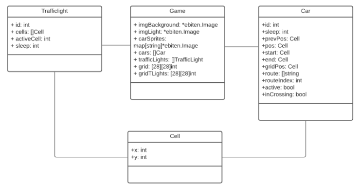

# Architecture

## Introduction

The presented project is a multithreaded city trafficsimulator where every car and
semaphore are independent entities. Street directionsand semaphores are
respected by the cars.

## Technical Requirements

```
● The city's map can be static or automatically generated.
● Cars and semaphore numbers can be configured on thegame's start.
● For every car, define a random start and destinationpoint.
● Define a random speed for each car.
● If a car detects another car on his route and it'sslower, it must slow down its
speed.
● Each car and semaphore behaviour will be implementedas a separate
thread.
● Cars and Semaphores threads must use the same mapor city layout data
structure resource.
● Display finished cars' routes.
● Display each car's speed.
```
## Requirements

go get github.com/hajimehoshi/ebiten/v

go get github.com/hajimehoshi/ebiten/v2/ebitenutil

## Ebiten library

Ebiten is an open source game library for the Go programminglanguage.

Ebiten's simple API allows you to quickly and easilydevelop 2D games that can be
deployed across multiple platforms.

## Ebiten Game Design


Ebiten library 'sebiten.Game. There are three necessary methods that require
implementation:

```
● Update: Game logic
● Draw: Renders images in every frame.
● Layout: Overall game layout.
● GAME: Class where everything is managed.
```
You can appreciate the UML in the image below:



## Function Description

### func loadImages() error

```
● Fetches all the sprites from the Res folder
```
### func moveCar(car Car)

```
● Moves the car to the desired position
● Checks if the Traffic Light is open
● Updates the cars array to reflect changes
● Controls the car speed
● Does not move car if the next cell is occupied
```
### func changeTrafficLight(tLight TrafficLight)

```
● Changes Traffic Light status
```

### func drawCars(screen *ebiten.Image)

```
● Writes the car into the Grid
```
### func drawTrafficLights(screen *ebiten.Image)

```
● Writes the Traffic Lights into the Grid
```
### func (g *Game) Draw(screen *ebiten.Image)

```
● Calls the drawTrafficLights method
● Calls the drawCars method
```
### func (g *Game) Layout(outsideWidth, outsideHeightint) (screenWidth,

### screenHeight int)

```
● Returns the GUI Height
● Returns the GUI Width
```
### func initCity(newCars []Car, tLights []TrafficLight)

```
● Lets the cars occupy their initial cell
● Starts all the traffic lights cells
● Fills missing intersection cell with a "free" space
```
### func generateRoute(grid [][]string) ([]string, Cell,Cell)

```
● Generates random route
● Generates random initial position
● Generates route and steps in order to follow streetdirections
```
### func getIntersectionSteps(grid [][]string, x int,y int, lastDir string)

### []string

```
● Returns intersection steps
```
### func getLastPosition(x int, y int, lastDir string)Cell

```
● Returns Car’s last Cell Position
```
### func main()

```
● Reads grid file
● Initializes cars
```

